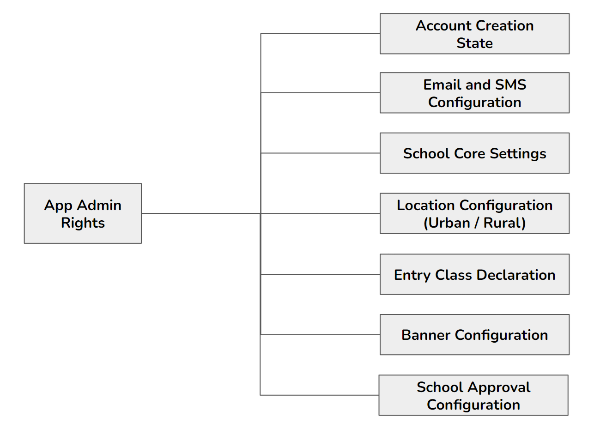

# App Administration
The app admin module is concerned with all features required for the application's administration by the user, who can be considered the super administrator of the application. It is the app administrator's responsibility to configure the application to suit the needs of the state government.

## Multilingual Feature
This is a feature that is going to be implemented in the RTE-MIS portal. The RTE-MIS portal will be used in different states, and all states have a language other than English. This is the reason why this multilingual feature is implemented in the RTE-MIS portal.

The basic language in the RTE-MIS portal is English, but there is an option through which the State can translate their state's language and apply it to the portal.

1. There should be a feature that allows the user to upload a bulk translation. This may be in the form of an Excel sheet.

2. Users can also have the option to add translations one by one.

3. Only the State admin should be able to make and modify translations.

4. There should be an option for the state admin to delete or modify any translation that comes on a need basis.

## School UDISE Configuration
UDISE can be configured in two ways: first, by following the bulk upload process, and second, by having API integration. API integration is not followed during MVP creation. But the process has been explained.

1. In the bulk upload process, during the first year, since it will be time-consuming to onboard all the schools by asking them to fill in their data, the state will need the option to bulk upload school information through the backend. Process flow -

    a. A state or District person uploads a CSV or Excel file (a standard file with a predefined template for columns)
    
    b. States can upload for all districts, and districts can upload for their district only.

    c. Once the file is uploaded, the system saves the school information, marks the account status as BULKUPLOAD and verifies it.

    d. In this process, there is the possibility that some schools that may be newly recognised are not available on the state's list. For the next years, to include the new UDISE code in the RTE portal, we need to provide a panel in the Block admins login where the Block-level authority can submit some basic details to the schools by offline validating the schools.
    
    e. School information that the Block admin adds should be marked as INDIVIDUAL, which needs to be verified by the district admin, who is the higher authority.
    
    f. DEOs can verify the new school's information by visiting the UDISE portal (from which schools will receive recognition and be assigned a UDISE code).

    g. Once the school's UDISE code is added to the RTE database either by BULKUPLOAD or by INDIVIDUAL upload process and the status is verified, only the school can create an account to register for a particular campaigning year.

2. Another way schools can be onboarded for the campaigning year is through an API integration from the UDISE portal, which skips the UDISE configuration part. API integration will be explained in the school account creation section (School management module Point 1).

3. A panel should be where the Block admin can perform the CRUD operations on existing school information. For example, on a requirement basis, BEOs can change a school's status from non-minority to Minority, from non-aided to aided, and the school's active status to inactive and vice versa.

4. Regarding API integration, UDISE integration from the UDISE portal will happen once. Then, that particular UDISE will be disconnected from the API now if there is a change in the status of the school, which will be modified by the Block admin from the panel, which we will create in point 3.

5. Fields that are required:
    a. UDISE code (Numeric only, mandatory, fixed to 11 digits, Non-primary key)

    b. School Name (alphabetic, mandatory)

    c. District Code (Number only, can be of a minimum of 3 digit max can be up to 5 or 6)

    d. Block ID/code (Number only, can be of a minimum of 3 digit max can be up to 5 or 6)

    e. U/ R (Alphabetic, one digit which keeps U for urban and R for rural)

    f. Minority (Y/N) (Boolen, 1 for Yes and 0 for No)

    g. Aided (Y/N) (Boolen, 1 for Yes and 0 for No)

    h. Active (Y/N) (Boolen, 1 for Yes and 0 for No)

Note:
{:.fw-500 }
1. There should be a possibility that schools that do not have a recognition certificate are not alloted UDISE code until the school registration/renewal process is going on. In this situation, the school admin can try to enter an invalid (or temporary or wrong) UDISE code to benefit from this scheme. There is also the possibility that the school will not get the recognition certificate for any reason. However, with the wrong UDISE code, the school is registered and will get the wrong admission of students. So, to avoid this type of situation, this should be provided to the BEOs login, and there should be a declaration from the 

2. BEO that they have validated the schools. DEOs should also make the next level of verification.
BEOs will offline inform the schools that they have been added and verified and that the schools can now create an account for the campaign.

3. The district admin should be responsible for verifying the Excel records offline.

4. The portal should not verify this because we are not following API integration through the UDISE portal. If the State follows API integration, there is no need for bulk or individual uploads. Also, the records will be directly verified from the External (UDISE) portal when the school account is created.

5. For schools that are non-minority, non-aided, active and verified by DEO, only those schools can be eligible for account creation, and only the list of these schools will be displayed on the dropdown list to create an account.

## State Location Configuration
Location should be configurable from the state level; levels of the geographical locations will be fixed to eight, but the display name should be configurable as per state requirements or as the name of the area that the State uses. There is a table where we manage this state-specific mapping information: which location name belongs to which table.

As the names of the levels have been defined and entered, these names will be displayed in the portal. The end user can easily filter his/her living location from the list. Below is the level of location that is going to be followed:

- State

- District

- Urban / Rural

- Block

- Nagariya Nikay (In case Urban)

- Ward (In case Urban)

- Gram Panchayat (In case of Rural)

- Habitations (In case of Both)

  

There is a possibility that each state has their name to call the level of locations. For this, there is a configurable section where the state admin can define the name of the locations they are using for their state, and this information will be stored in a table in the database.

## Integration of SMS & Email Services
1. Email and SMS services are required in this portal to validate all admin's authenticity. Email and SMS services are required to validate the user when creating a school account.

2. The SMS services are the majorly used services in the RTE-MIS portal. The SMS services will be used to validate the schools at the time of account creation and to get the verification status message.

3. To recover the password, an OTP verification will be made, and then the admin can update their password.

4. Another use is in the student module, to send SMS to registered students to confirm registration, and then from time to time, the status of applications is going to be changed, they receive intimation through SMS.
5. In the lottery process, allotted applications will also get the first intimation via SMS to their registered mobile number.

## Google Map Integration
Google map Integration is done for the school registration part, mainly used to collect the latitude and longitude of the school's parent location. The purpose of collecting this information is to integrate the GIS location mapping with the parent's parent location to show them the list of schools to the parent for applying for the campaign. This should be limited to a 1 to 3 km radius as per the government rule.

Note: States can define their distance criteria, which should also be configurable.

## Forgot Password Recovery
1. There is a possibility that the user can forget their login password. In this situation, the user can reset the password by clicking the reset password option on the login page.

2. To reset the password, users enter the username and get an OTP on their registered mobile number and email ID; after validating the OTP, users can create a new password.

3. Once the OTP is sent to the registered mobile number and email ID, the Ending of 4 numbers and crossed email ID of the registered mobile number and email ID will be displayed on the reset page panel.

4. OTP, which will be sent on mobile number and Email ID, should be the same.

5. The Resend button will be displayed after 1 minute. Messages (OTP invalid or expired) should be displayed on the page. The timer should also display.

6. Flood control option should be there.

7. In case a registered mobile number is not in use anymore, and the user is unable to get OTP on the registered mobile number, then he/she needs to visit their higher authority to get their registered mobile number updated.
8. Dedicated higher authority can update the registered mobile number; this update also requires an OTP validation. Due to this, the user needs to be physically present with their dedicated higher authority.
9. Once the new mobile number is registered, the user can reset their password.

10. The user's level should be like School should go to Block admin, Block admin request to District admin, District admin request to the State admin, and in case of State admin, app admin or IT admin will directly update the details.

11. User name should be UDISE code for schools and email ID for all govt admins and roles.

12. If the user forgets their registered email ID, which will be used as a username, then the user can request higher authority to change or recover the username. Then the IT admin will directly provide or update the email ID which is going to be used as username.

13. Passwords should be hashed.

## School Mapping
1. School mapping (mapping a school to nearby neighborhood areas) can be done in two ways: manual mapping or GIS mapping. For the mapping process, a block admin should follow the distance rules defined by the State.

2. A manual mapping portal will not capture the distance information, but it needs to collect the distance information in the case of a GIS mapping portal. This portal will calculate the distance between the school and the student's residence, and based on the distance saved, a list of schools will be displayed to the parent to select the school. In the MVP, we are not covering the GIS option. This will be customisable as per State's requirement.

3. Block admin will be the person who will be responsible for mapping a school to nearby habitation.

4. Once a school is verified from the block level (first-level approval), they can immediately map approved schools to nearby neighborhood areas per State govt rules.

5. Mapping should be renewed every year. This should be mandatory for block admins to re-check the mapping, and if any changes are required, then after making those changes, the block admin should submit the changes.

6. It should also be the responsibility of the district admin to verify those changes and approve them on the portal.

7. Once the mapping is approved, that school will be allowed to take admission for the current campaign cycle.

8. We should have a section to identify the duration for school mapping on the campaign creation page. We must define the Start and end date selection options to perform mapping work.

9. There should be a level approval option; Block admins will add the habitations to the schools, and District admins will verify this while approving school registration or renewal.

10. Mapping will be done after the first verification level, which the block admins will do.

11. Whenever the mapping renewal happens, at that time, existing mapping records should be displayed, and block admin can make necessary changes as per requirement.

12. If Mapping is not approved for the particular campaigning cycle, then that particular school should not display for the student application.

13. There should be a view panel for the block admin to see the school records, through which block admins can see the list of schools with current status. The same should also be available to the District admin to see and verify schools.

