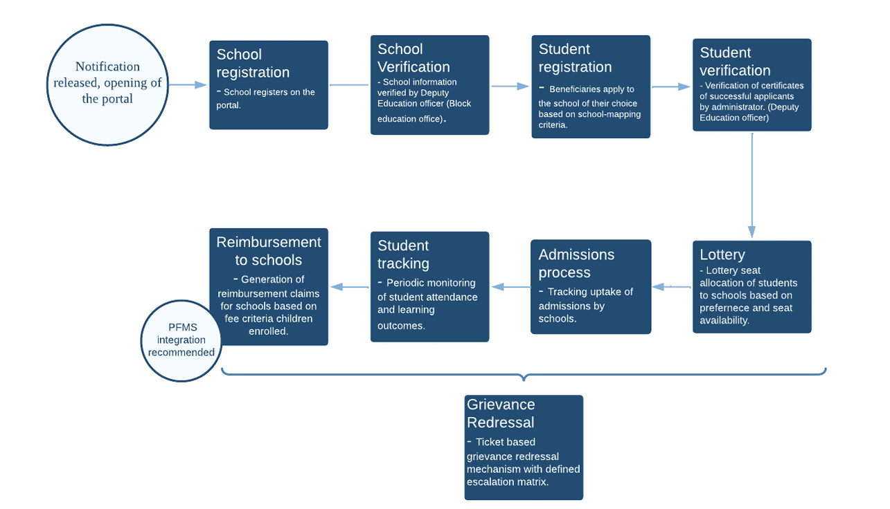

# Functional Documentation

Below diagram demosnstrates the different stages in the complete admission cycle at a high level
{: .fs-6 .fw-300 }      

## 1. App Administration
The app admin module is concerned with all features required for the application's administration by the user, who can be considered the super administrator of the application. It is the app administrator's responsibility to configure the application to suit the needs of the state government.

The app administrator will be responsible for user management, creating the account for State administration, defining permissions and privileges for different user roles, and content management.

## 2. State Management
In the State module, the state admin has the power to manage the roles of the other government authorities and their rights, schedule the campaign cycle, trigger different rounds of lottery, send SMS to allotted students, and perform the reimbursement process to the beneficiaries' (schools) accounts.

## 3. School Module
In School Modules, school administrations enroll for specific academic cycles. To participate in the RTE scheme, a private school must have an account on the MIS portal. Once the account is created, the school can register itself. Further from the preceding years, schools need to modify their existing information.

In this module, school administrators provide schools with information that is required for participating in the scheme. Information like - location information, recognition information, seat information, entry class information, fees information, CWSN availability information, bank account details, etc.

Once the registration process is completed, the government authority performs the verification and makes necessary mapping operations to the verified school.

## 4. Student Module
In this module, applicants who wish to participate in the RTE scheme and want to benefit from this scheme will apply and participate in it by filling out the application form. Applicants need to provide their information on the application form and submit the hard copy of the filled application to the respective government authorities.

After the application submission, government authorities perform the application verification process and change the application status per the document received. Once the verification process is complete, it moves to the next stage, triggering the lottery.

## 5. Lottery Module
The lottery module primarily concerns the lottery algorithm (for filtering and allotting applicants to available seats) and the feature to execute the algorithm against the applicant data.

The lottery process involves applying a set of conditions described by the government in the initial notification and allotting applicant children/students to available seats. States are free to add categories; two major categories were applied: Disadvantaged Groups and Weaker Sections. Distance is another criteria that applies in the lottery process. States have the right to define the distance criteria for their specific state.

## 6. Admission Module
In the admission module, schools will be able to see the list of students who are allotted to their school and can perform the necessary actions on the applications. School admins play a major role in this module; they must mark the student as admitted, not admitted, or in dropout status based on their actual admission to the school. Using these statuses, schools update admitted students' performance and make claims for all admitted students.

## 7. Student Tracking Module
The student tracking feature enables schools to track school attendance and performance of students admitted/retained under the RTE 12(1)(c) scheme. Updating student performance details is a year-long process, and the school admins should have the facility within the school admin panel to update them regularly.

Student attendance and performance are tracked primarily to verify reimbursement claims from schools and also monitor the impact of the RTE 12(1)(c) scheme itself.

## 8. Reimbursement Module
This module concerns the state government's reimbursement of fees to the participating private schools. In this module, the school administration makes reimbursement claims, verifies claims performed by preceding government authorities, and processes claims made by state authorities using a specified payment gateway.

This module also tracks the status of reimbursements due to schools in lieu of tuition & other expenses incurred by the school on behalf of all children admitted under the provision.

## 9. Grievance Module
This module is concerned with the handling and processing grievances raised by participating schools and parents of the students to government officials. Government officials handle all grievances and update the status on the portal using this module after grievances have been resolved.

Grievances can be raised by the parents/guardians, schools, blocks, and districts that can be raised either to their immediate authorities or directly to the State authorities. All the officers will take necessary action (offline) and update the resolution status online.

## 10. Public Pages
Public page modules consist of the pages or screens that do not require login authentication and the pages that should be easily accessible to the stakeholders. This module mainly holds general information about the scheme, the application process, application pages, basic reports required for application, and a page for raising grievances. Time-to-time notifications are displayed on this module.

The app administrator will manage the content of these pages using a content management system present in the app. Certain content, such as notifications, press releases, documents, and instructions, will likely change during scheme implementation. Therefore, a content management system is essential.

## 11. Additional Features
The additional background required setups will happen in this part. Some sections need to be created as a basic setup, like Multilingual features, Integration of SMS and Email integration, etc.